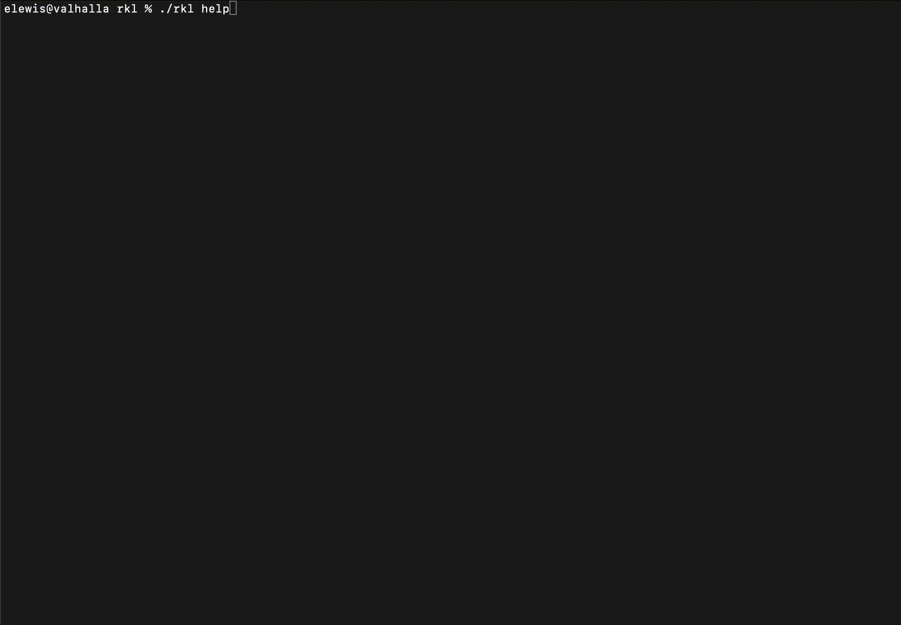

# Boa
[](https://pkg.go.dev/github.com/elewis787/boa#section-readme) [](https://goreportcard.com/report/github.com/elewis787/boa)

Boa implements [Cobra's](https://github.com/spf13/cobra) help and usage functions to provided an interactive user experience by leveraging [Bubbletea](https://github.com/charmbracelet/bubbletea). User's no longer need to spend time running multiple help commands to see how nested sub commands work!

## Install 

Use go get to install the latest version of the library.

`go get -u github.com/elewis787/boa@latest`

Next, include Boa in your application:

`import "github.com/elewis787/boa"`

## Usage

Using Boa is very simple. Below is an example on how to set the help/usage functions on a root command defined using Cobra. 

```go
	rootCmd := &cobra.Command{
		Version: "v0.0.1",
		Use:     "Example",
		Long:    "Lorem ipsum dolor sit amet, consectetur adipiscing elit, sed do eiusmod tempor incididunt ut labore et dolore magna aliqua.",
		Short:   "example command",
		Example: "example [sub command]",
		RunE: func(cmd *cobra.Command, args []string) error {
		    return nil
		},
	}

	rootCmd.SetUsageFunc(boa.UsageFunc)
	rootCmd.SetHelpFunc(boa.HelpFunc)

```

The key lines are: 

```go
	rootCmd.SetUsageFunc(boa.UsageFunc)
	rootCmd.SetHelpFunc(boa.HelpFunc)
```

To futher customize the look and feel of boa, you can optional set additional styles or extend the defaults  

```go 
	styles := boa.DefaultStyles()
	styles.Title.BorderForeground(lipgloss.AdaptiveColor{Light: `#E3BD2D`, Dark: `#E3BD2D`})
	styles.Border.BorderForeground(lipgloss.AdaptiveColor{Light: `#E3BD2D`, Dark: `#E3BD2D`})
	styles.SelectedItem.Foreground(lipgloss.AdaptiveColor{Light: `#353C3B`, Dark: `#353C3B`}).
		Background(lipgloss.AdaptiveColor{Light: `#E3BD2D`, Dark: `#E3BD2D`})

	b := boa.New(boa.WithStyles(styles))

	rootCmd.SetUsageFunc(b.UsageFunc)
	rootCmd.SetHelpFunc(b.HelpFunc)
```

Use the documentation to see a full list of styles as well as other available options that can be set.

## Demo 



## Used by 
- [rkl](https://github.com/elewis787/rkl)
- [m8](https://github.com/kochavalabs/m8)
- [botway](https://github.com/abdfnx/botway) 
- [gh-app-adm](https://github.com/VauntDev/gh-app-adm)	

## Future work 
- ~Eval how styles are exported. Goal is to make it easy to customize the layout without needing to build a cmd parser for cobra~ 
- ~Add back button~ 
- Option to execute sub command 
- ~Adjust help based on cmd context availability~ 
- Other ideas ? - Open a feature request or submit a PR ! 
